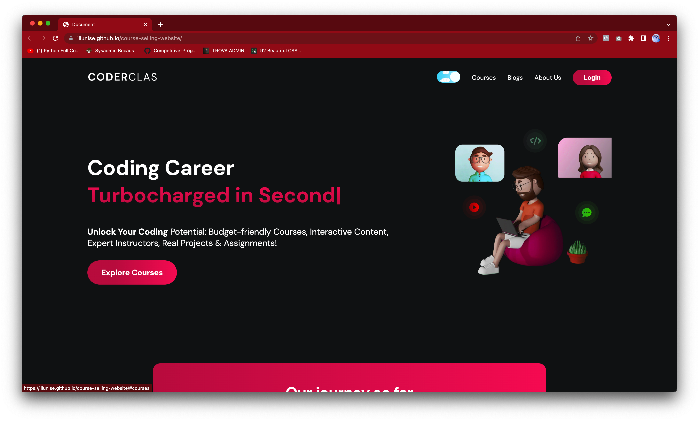
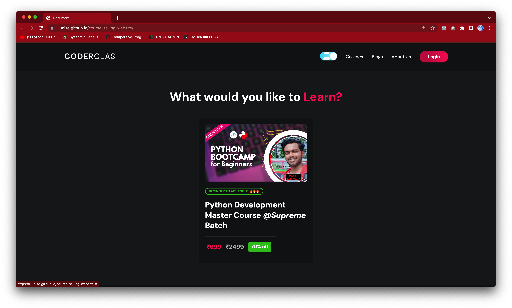
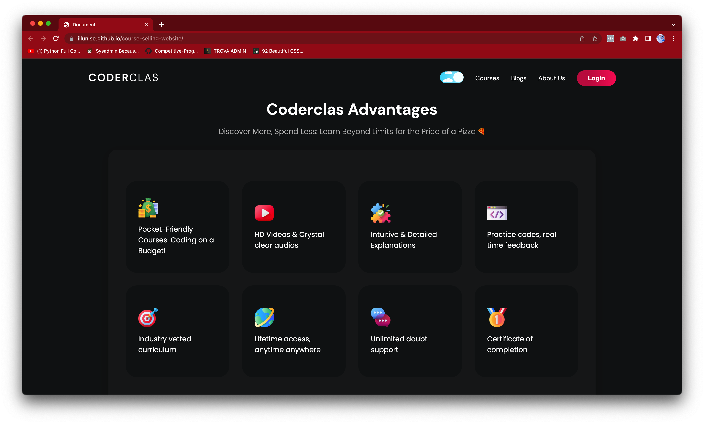
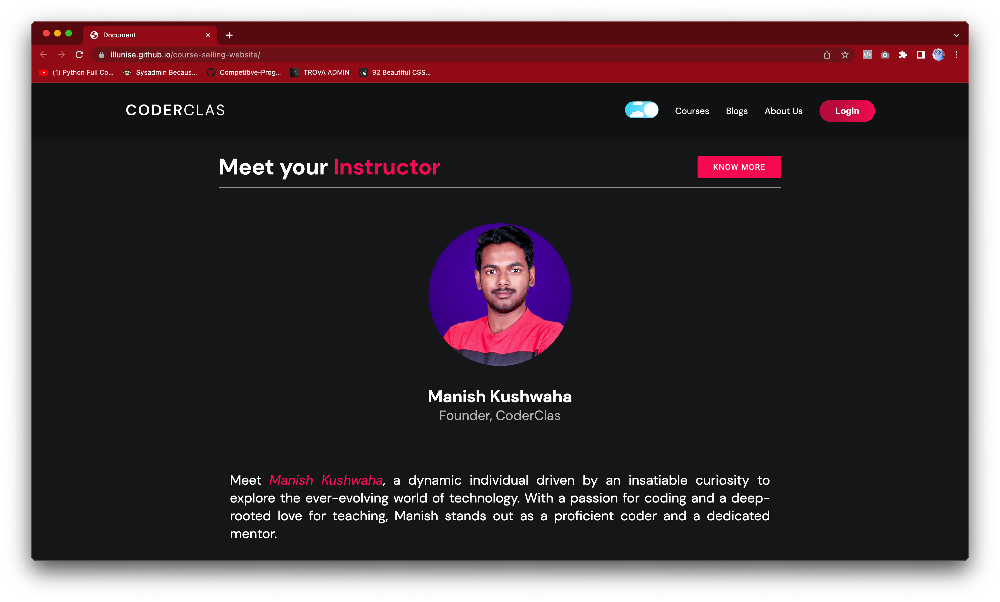
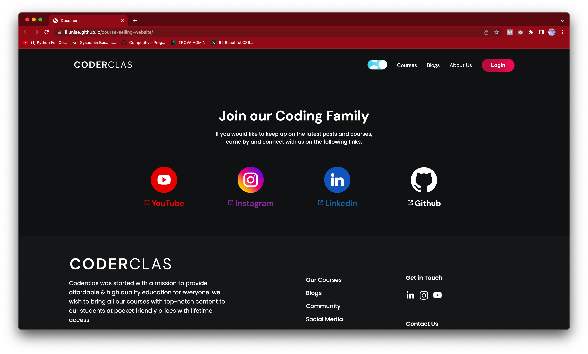

# Course Selling Website 📚💻
This repository contains the source code for a course selling website, a comprehensive online platform designed to facilitate the sale and distribution of educational courses. Built using HTML, CSS, and JavaScript, this website offers a user-friendly interface with interactive features and a seamless browsing experience.


## Features 🌟

- **Course Catalog:** Browse through a wide range of courses, organized into categories and subcategories for easy navigation. Each course listing includes detailed information such as the course title, duration, and a brief description.

- **Instructor Profiles:** Instructors have dedicated profiles where they can showcase their expertise, list their courses, and interact with learners. Learners can view instructor profiles to gain insights into the instructors' qualifications and teaching styles.

- **Responsive Design:** The website is designed to be responsive, ensuring an optimal viewing experience across a variety of devices, including desktops, tablets, and mobile phones.

- **Social Sharing:** Users can communicate with the social media community of the website. 📱💬

## Screenshots 📷


*Course Main Page - Home Section of the Main Page.*


*Courses - List of courses provided by the website.*


*Course Details - Get detailed information about each course, including advantages, duration, and many more.*


*Instructor - Details about the instructor who is teaching the course.*


*Social Media - Links to the social media community.*


## Languages Used

  

## Getting Started 🚀

To run the project locally, follow these steps:

1. Clone the repository: `git clone https://github.com/illunise/course-selling-website.git`
2. Open the project directory in your preferred code editor.
3. Set up a local development environment, such as XAMPP or WAMP, to run the website.
4. Start the local server and access the website through your preferred browser.
5. Explore the website, interact with the features, and customize it to suit your needs.

## Contributing 🤝

Contributions to this project are welcome! If you have any suggestions, improvements, or bug fixes, please submit a pull request. Be sure to adhere to the coding conventions and maintain consistent coding styles.

If you encounter any issues or would like to request a new feature, please open an issue in the repository, providing as much detail as possible.

## Acknowledgements 🙏

We would like to express our gratitude to the open-source community for providing valuable resources and frameworks that made this project possible. Additionally, we extend our thanks to all contributors for their efforts in improving and enhancing this course selling website.

## MIT License 📜

```plaintext
MIT License

Copyright (c) 2023 Manish Kushwaha

Permission is hereby granted, free of charge, to any person obtaining a copy
of this software and associated documentation files (the "Software"), to deal
in the Software without restriction, including without limitation the rights
to use, copy, modify, merge, publish, distribute, sublicense, and/or sell
copies of the Software, and to permit persons to whom the Software is
furnished to do so, subject to the following conditions:

The above copyright notice and this permission notice shall be included in all
copies or substantial portions of the Software.

THE SOFTWARE IS PROVIDED "AS IS", WITHOUT WARRANTY OF ANY KIND, EXPRESS OR
IMPLIED, INCLUDING BUT NOT LIMITED TO THE WARRANTIES OF MERCHANTABILITY,
FITNESS FOR A PARTICULAR PURPOSE AND NONINFRINGEMENT. IN NO EVENT SHALL THE
AUTHORS OR COPYRIGHT HOLDERS BE LIABLE FOR ANY CLAIM, DAMAGES OR OTHER
LIABILITY, WHETHER IN AN ACTION OF CONTRACT, TORT OR OTHERWISE, ARISING FROM,
OUT OF OR IN CONNECTION WITH THE SOFTWARE OR THE USE OR OTHER DEALINGS IN THE
SOFTWARE.
```
